# CloudWatch LogGroup Retention Monitor

🎯 **AWS Serverless Application** for CloudWatch log retention compliance monitoring. This app overcomes limitations in the AWS native config rule (`CW_LOGGROUP_RETENTION_PERIOD_CHECK`), which marks infinite retention as compliant and can lead to unexpected costs. Monitors compliance without modifying log groups.

**Marketplace:** LogGuardian is available in the AWS Serverless Application Repository: [LogGuardian SAR](https://serverlessrepo.aws.amazon.com/applications/ca-central-1/410129828371/LogGuardian)

[](https://serverlessrepo.aws.amazon.com/applications)
[](LICENSE)
[](https://aws.amazon.com/config/)
[](https://github.com/zsoftly/aws-config-rules/actions/workflows/ci.yml)

## 🔥 Problem Solved

AWS's default Config rule `CW_LOGGROUP_RETENTION_PERIOD_CHECK` **incorrectly marks infinite retention as compliant**, leading to unexpected costs. This application fixes that critical flaw by providing accurate compliance monitoring:

- ❌ **NON_COMPLIANT**: Log groups with infinite retention (`null`)
- ❌ **NON_COMPLIANT**: Log groups below the minimum retention period  
- ✅ **COMPLIANT**: Log groups that meet or exceed the minimum retention period

**Note**: This tool monitors and reports compliance only - it does not automatically modify log group retention settings.

## ⚠️ Prerequisites

**AWS Config must be properly set up before deploying any Config rules.** This application will **fail** if these requirements aren't met.

### AWS Config Service Setup

AWS Config requires **three components** to function:

1. **📦 S3 Bucket** - Stores configuration snapshots and history
2. **🔧 Configuration Recorder** - Records resource configuration changes  
3. **📬 Delivery Channel** - Delivers configuration data to S3

### Quick Setup Options

#### Option 1: AWS Console (Recommended for first-time users)
1. Go to [AWS Config Console](https://console.aws.amazon.com/config/)
2. Click **"Get started"** → **"1-click setup"**
3. Accept defaults or customize S3 bucket name
4. ✅ **Done!** All prerequisites automatically configured

#### Option 2: AWS CLI (For existing setups)
```bash
# Check if Config is already set up
aws configservice describe-configuration-recorders
aws configservice describe-delivery-channels

# If empty responses, Config needs setup - use Console option above
```

#### Option 3: Automated Check (Recommended)
```bash
# Download and run our prerequisites checker
curl -O https://raw.githubusercontent.com/zsoftly/aws-config-rules/main/check-config-setup.sh
chmod +x check-config-setup.sh
./check-config-setup.sh
```

### Detailed Requirements

| Component | Requirement | AWS Documentation |
|-----------|-------------|-------------------|
| **S3 Bucket** | Bucket with Config service permissions | [S3 Bucket Policy](https://docs.aws.amazon.com/config/latest/developerguide/s3-bucket-policy.html) |
| **IAM Role** | Service-linked role or custom role | [IAM Permissions](https://docs.aws.amazon.com/config/latest/developerguide/iamrole-permissions.html) |
| **Configuration Recorder** | Must be created and **started** | [Configuration Recorder](https://docs.aws.amazon.com/config/latest/developerguide/stop-start-recorder.html) |
| **Delivery Channel** | Links recorder to S3 bucket | [Delivery Channel](https://docs.aws.amazon.com/config/latest/developerguide/manage-delivery-channel.html) |

### Cost Estimate
- **AWS Config**: ~$2-10/month (depending on resource count)
- **S3 Storage**: ~$1-5/month (depending on retention)
- **This Rule**: <$1/month

[📊 Detailed Cost Breakdown](https://aws.amazon.com/config/pricing/)

### Verification Commands
```bash
# Verify Config is properly set up
aws configservice describe-configuration-recorder-status
aws configservice describe-delivery-channel-status

# Both should show "recording": true and "lastStatus": "SUCCESS"
```

### ⚡ Quick Troubleshooting

| Issue | Cause | Solution |
|-------|--------|----------|
| Rule doesn't trigger | Config recorder stopped | Run `aws configservice start-configuration-recorder` |
| Permission errors | Missing IAM permissions | Use [service-linked role](https://docs.aws.amazon.com/config/latest/developerguide/using-service-linked-roles.html) |
| No evaluations | Resource types not recorded | Check recorder [resource selection](https://docs.aws.amazon.com/config/latest/developerguide/select-resources.html) |

---

## 🚀 One-Click Deployment (Recommended)

### AWS Serverless Application Repository

**Deploy in 30 seconds with zero setup required:**

1. **Open the AWS Console** → Serverless Application Repository
2. **Search**: `CloudWatch LogGroup Retention Monitor`
3. **Click Deploy** → Configure parameters → Deploy
4. **Done!** ✅

**Any AWS Region:**
- AWS SAR automatically distributes to all regions
- Search in your preferred region's SAR console

### Parameters

| Parameter | Default | Description |
|-----------|---------|-------------|
| **MinimumRetentionDays** | `1` | Minimum retention period (1-3653 days) |
| **ConfigRuleName** | `cw-lg-retention-min` | Name for the Config rule (must contain 'retention') |
| **LambdaLogRetentionDays** | `7` | Retention period for Lambda function logs (1-3653 days) |

## 📦 Alternative Deployment Methods

### AWS SAM CLI (For Development)

```bash
git clone https://github.com/your-org/aws-config-rules
cd aws-config-rules

# Build and deploy
sam build && sam deploy --guided
```

## 🎯 How It Works

### Rule Logic
```python
if log_group.retentionInDays is None:
    return "NON_COMPLIANT"  # ❌ Infinite retention = cost risk
elif log_group.retentionInDays < minimum_days:
    return "NON_COMPLIANT"  # ❌ Below minimum retention period
else:
    return "COMPLIANT"      # ✅ Meets or exceeds minimum requirement
```

### Evaluation Schedule
- **Periodic**: Every 24 hours (checks all log groups)
- **Real-time**: When log groups are created/modified
- **Manual**: Trigger via AWS Console or API

## 📊 Compliance Results

### Example Evaluations

| Log Group | Current Retention | Minimum | Status | Annotation |
|-----------|------------------|---------|--------|------------|
| `/aws/lambda/my-func` | `null` | 1 | ❌ NON_COMPLIANT | Has infinite retention (null) |
| `/custom/app` | `7 days` | 30 | ❌ NON_COMPLIANT | Has 7 days, minimum required 30 |
| `/secure/logs` | `30 days` | 7 | ✅ COMPLIANT | Has 30 days, meets minimum of 7 |
| `/archive/data` | `365 days` | 30 | ✅ COMPLIANT | Has 365 days, exceeds minimum of 30 |

### View Results

**AWS Console:**
```
Config → Rules → cw-lg-retention-min → Compliance
```

**AWS CLI:**
```bash
aws configservice get-compliance-details-by-config-rule \
  --config-rule-name cw-lg-retention-min
```

## 💰 Cost Impact

### Cost Savings
- **Identifies infinite retention** log groups costing $$$
- **Enforces consistent policy** across all log groups
- **Prevents cost surprises** from forgotten log groups

### Rule Cost
- **Lambda execution**: ~$0.01/month
- **Config evaluations**: ~$0.10/month (100 log groups)
- **Total**: <$1/month for most accounts

## 🔧 Configuration

### Valid Retention Values
CloudWatch supports these retention periods:
```
1, 3, 5, 7, 14, 30, 60, 90, 120, 150, 180, 365, 400, 545, 731, 1827, 3653 days
```

### Environment Variables
| Variable | Description | Default |
|----------|-------------|---------|
| `REQUIRED_RETENTION_DAYS` | Required retention period | `30` |

### IAM Permissions Required
The Lambda function needs:
- `logs:DescribeLogGroups` - List all log groups
- `config:PutEvaluations` - Submit compliance results

## 🏗️ Architecture

```mermaid
graph TB
    A[CloudWatch Log Groups] --> B[AWS Config Service]
    B --> C[Lambda Function<br/>cw-lg-retention-monitor]
    C --> D{Compliance Check}
    
    D --> E1[✅ COMPLIANT<br/>retention ≥ minimum<br/>e.g., 30 days ≥ 7 days]
    D --> E2[❌ NON_COMPLIANT<br/>retention = null infinite<br/>OR retention < minimum<br/>e.g., 3 days < 7 days]
    
    E1 --> F[Config Results]
    E2 --> F[Config Results]
    F --> G[AWS Console/API<br/>Compliance Dashboard]
    
    H[⏰ Schedule Trigger<br/>Every 24 hours] --> C
    I[🔄 Change Trigger<br/>Log group created/modified] --> C
    
    J[📋 Rule Parameters<br/>MinimumRetentionDays: 1-3653] --> C
    
    classDef aws fill:#ff9900,stroke:#232f3e,stroke-width:2px,color:#fff
    classDef lambda fill:#ff9900,stroke:#232f3e,stroke-width:2px,color:#fff
    classDef decision fill:#ffc107,stroke:#f57c00,stroke-width:3px,color:#000
    classDef compliant fill:#4caf50,stroke:#2e7d32,stroke-width:2px,color:#fff
    classDef noncompliant fill:#f44336,stroke:#d32f2f,stroke-width:2px,color:#fff
    classDef trigger fill:#2196f3,stroke:#1565c0,stroke-width:2px,color:#fff
    classDef config fill:#9c27b0,stroke:#6a1b9a,stroke-width:2px,color:#fff
    classDef params fill:#607d8b,stroke:#37474f,stroke-width:2px,color:#fff
    
    class A,B,C,G aws
    class D decision
    class E1 compliant
    class E2 noncompliant
    class H,I trigger
    class F config
    class J params
```



## 🚨 Troubleshooting

### Config Rule Not Working

#### ❌ Rule Never Evaluates
**Check Config Prerequisites:**
```bash
# Verify Config is set up and running
aws configservice describe-configuration-recorder-status
aws configservice describe-delivery-channel-status

# Expected: Both show "recording": true and "lastStatus": "SUCCESS"
```

**Solutions:**
- **No Config setup**: Use [AWS Config Console](https://console.aws.amazon.com/config/) → "Get started"
- **Recorder stopped**: Run `aws configservice start-configuration-recorder --configuration-recorder-name default`
- **Wrong region**: Ensure you're in the correct AWS region

#### ❌ Rule Evaluates but Shows Errors
**Check Lambda Logs:**
```bash
# View function logs
aws logs filter-log-events \
  --log-group-name "/aws/lambda/YOUR-FUNCTION-NAME" \
  --start-time $(date -d '1 hour ago' +%s)000
```

**Common Issues:**
- **Permission denied**: Lambda role missing `logs:DescribeLogGroups`
- **Timeout errors**: Increase Lambda timeout (current: 5 minutes)
- **Memory errors**: Increase Lambda memory (current: 256MB)

#### ❌ Rule Shows "No Results" 
**Check Resource Recording:**
```bash
# Verify log groups are being recorded by Config
aws configservice list-discovered-resources \
  --resource-type AWS::Logs::LogGroup
```

**Solutions:**
- **No log groups found**: Create test log groups first
- **Not recording resource type**: Update recorder to include `AWS::Logs::LogGroup`
- **Different region**: Log groups are region-specific

### Manual Testing

#### Trigger Immediate Evaluation
```bash
# Force rule to run now (don't wait 24 hours)
aws configservice start-config-rules-evaluation \
  --config-rule-names YOUR-RULE-NAME
```

#### Check Specific Resource
```bash
# Get compliance for specific log group
aws configservice get-compliance-details-by-resource \
  --resource-type AWS::Logs::LogGroup \
  --resource-id "/aws/lambda/my-function"
```

### Getting Help

**Still having issues?**
1. 📋 **Check [AWS Config Troubleshooting Guide](https://docs.aws.amazon.com/config/latest/developerguide/troubleshooting-rules.html)**
2. 🐛 **[Open an issue](https://github.com/zsoftly/aws-config-rules/issues)** with:
   - AWS region
   - Error messages from CloudWatch logs
   - Output of verification commands above
3. 💬 **[Start a discussion](https://github.com/zsoftly/aws-config-rules/discussions)** for questions

---

## 📦 Maintainer & SAR Publishing

See [`SAR_README.md`](SAR_README.md) for instructions on publishing and maintaining this application in the AWS Serverless Application Repository.

## 🤝 Contributing

### Development Setup
```bash
git clone https://github.com/zsoftly/aws-config-rules
cd aws-config-rules

# Local development and testing
sam build && sam deploy --guided
```

## 📚 Additional Resources

- [AWS Config Rules Developer Guide](https://docs.aws.amazon.com/config/latest/developerguide/evaluate-config.html)
- [CloudWatch Logs Pricing](https://aws.amazon.com/cloudwatch/pricing/)
- [AWS Serverless Application Repository](https://aws.amazon.com/serverless/serverlessrepo/)
- [SAM CLI Documentation](https://docs.aws.amazon.com/serverless-application-model/latest/developerguide/what-is-sam.html)

## 📄 License

This project is licensed under the MIT License - see the [LICENSE](LICENSE) file for details.

## 🔄 Version History

- **v1.0.0** - Initial SAR release with core functionality
- **v0.9.0** - RDK-based implementation (legacy)

---

**⭐ If this project helps you save costs, please star it!**

Questions? Issues? [Open an issue](https://github.com/zsoftly/aws-config-rules/issues) or [start a discussion](https://github.com/zsoftly/aws-config-rules/discussions).